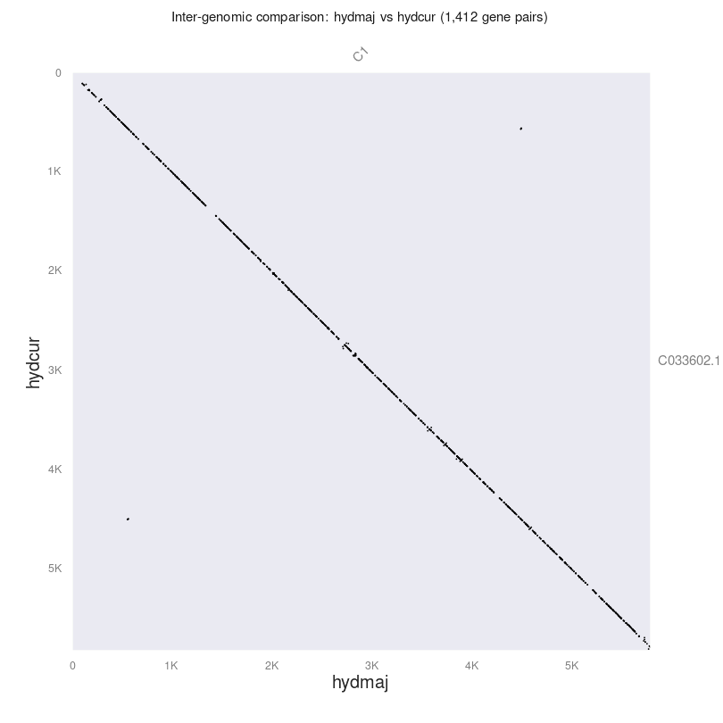
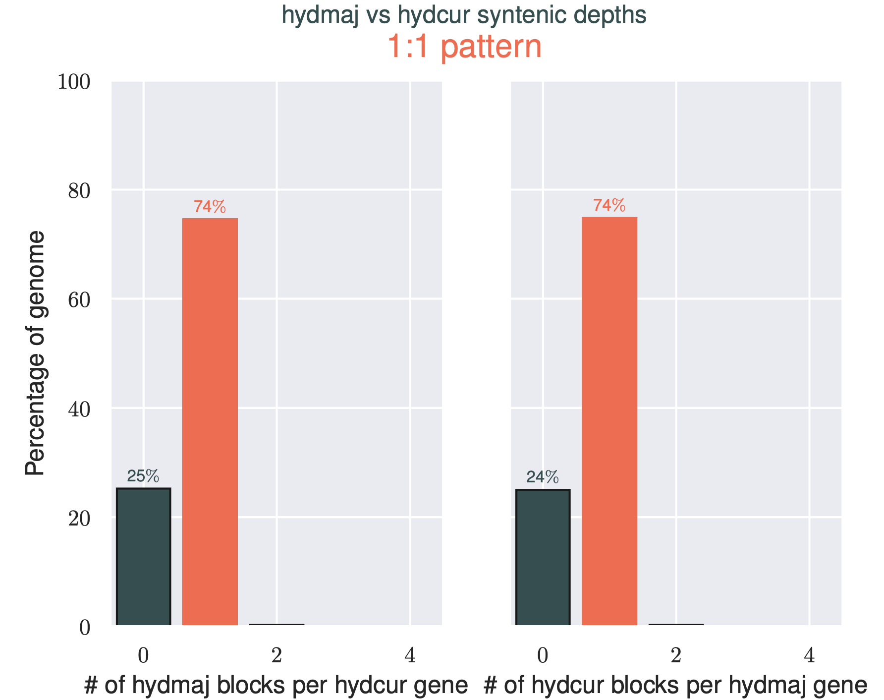
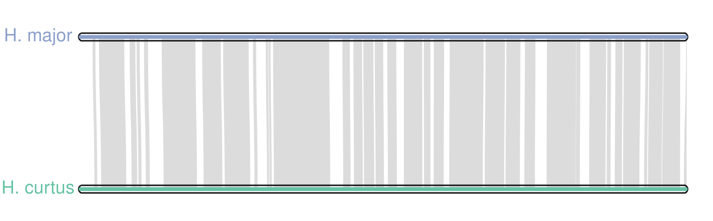

Comparing genetic sequences is a common task in genomics. There are a range of methods to evaluate
the similarities and differences within and between organisms. Here, I'll demonstrate how to generate
a ribbon plot between two chromosomes. Thumbnail from: https://github.com/tanghaibao/jcvi/wiki/MCscan-(Python-version)

---

# Introduction

Often we'll want to comapre genetic sequences to identify structural similarities or differences.
Depending on the sequence data you have, there are any number of ways to do this. For instance,
genetic variants can be used to compare sequences at the base-pair level, multiple sequence alignments
can be used to compare collections of sequences, while whole genome alignments can be used to assess
variations in overall genetic architechture. Increasingly more chromosome scale genome assemblies are
becoming available, making whole genome comparisons a logical starting point in comparative analyses.
Here, I'll outline how to compare chromosome scale sequences between two organisms, generating a range
of informative plots along the way.

# Background and software

[`MCscan`][mcscan] is a tool written in python for enabling the comparison of whole genome sequences with
relative ease. Typically, aligning whole chromosomes is a computationally intensive task. `MCscan` gets
around this problem by using gene sequences as anchors to aid alignment. For example, let's say we
have two chromosomal sequences that we know are homologs.

```text
Seq1    <------------------------------------------------------------------------------------>

Seq2    <--------------------------------------------------------------------------->
```

<br/>

`MCscan` uses genes as anchors to help alignment. Knowing that certain genes are shared between the
two sequences helps locate alignment seeds (i.e. shared regions that can be aligned). Further, as the
clustering of genes is ususally pretty conserved, aligners can use this information to better identify
larger syntenic regions prior to conducting base-pair alignment, greatly simplifying the overall alignment
problem (see below).

```text
seq1    <------------------------------------------------------------------------------------>
genes1          ... ...     ...      ...    ... ... ...         ... ... ... ...         ...
                 |   |       |               |   |   |           |   |   |   |           |
genes2          ... ...     ...             ... ... ...         ... ... ... ...         ...
seq2    |------------------------|         |-----------|       |-----------------------------|
```

# This Tutorial

In this tutorial, I'll walk through how to use [`Liftoff`][liftoff] to lift an annotation from
one organism to another, before using that annotation to show syntenic regions between two chromosomal
sequences with `MCscan`. 

I've generated a couple of test datasets to work with which are chromosome 1 from *Hydrophis major* and
*Hydrophis cyanocinctus*. These files are located on Box at [`Box:synteny-tutorial`][box]. They'll be used throughout
this whole tutorial. In addition to the raw files, I've also included example scripts for every stage of
this tutorial, along with the outputs. I recommend making a directory of your own following the same
structure and running the analyses yourself, using the scripts as a guide.

```bash
synteny-tutorial
├── figures
│   ├── hydmaj.hydcur.depth.png
│   ├── hydmaj.hydcur.dotplot.png
│   └── karyotype.png
├── liftoff-results
│   ├── hydcur.cds
│   ├── hydcur.gff3
│   ├── hydmaj.cds
│   └── hydmaj.gff3
├── mcscan
│   ├── hydmaj.hydcur.anchors
│   ├── ..truncated..
│   └── seqids
├── reference-genome
│   ├── tiger-reference.fa
│   ├── tiger-reference.fa.fai
│   ├── tiger-reference.gff3
│   └── tiger-reference.gff3_db
├── scripts
│   ├── 01-liftoff.sh
│   └── 02-mcscan.sh
└── seqs
    ├── hydcur.fa
    ├── hydcur.fa.fai
    ├── hydcur.fa.mmi
    ├── hydmaj.fa
    ├── hydmaj.fa.fai
    └── hydmaj.fa.mmi
```


# Step 1: Gene annotation

As stated above, `MCscan` uses gene annotations to find homologous regions between sequences to aid alignment.
If you have a genome assembly without an annotation file, it's possible to make one that'll do the job for
alignment purposes. The tool for the job is `Liftoff`, which lifts over the gene annotation of an evolutionarily
close organism onto your genome of interest. However, there are a few caveats to its use:

- The organism that you lift from needs to be evolutionarily close, otherwise you'll have few genes lift-over.
- The gene models produced on your genome will be accurate, but are not to be taken as gospel.
- Ensure your genome is of sufficient completeness. Fragmented genomes will have fewer genes lift over due to missing genetic content.
- The output annotation will only have genes found in the reference file! Novel genes will not be annotated.

It's important to note that the reference you use to annotate your own genome doesn't have to be the one you
are comparing to. Any evolutionarily close genome with an annotation will do.

## Install the software

All the tools we'll need are available through `conda` and can be installed into a virtual environment
as follows.

```bash
conda create -n synteny -c bioconda liftoff gffread last jcvi more-itertools
```

<br/>

The command above will create a conda environment `synteny` and install the software `liftoff`,
`gffread`, `last` and `jcvi` (contains `MCscan`) within it.

The `conda` environment can be activated using the command

```bash
conda activate synteny
```

<br/>

All commands from here should be run from within this environment (i.e. after runing the activate
command above).

## The input files

`Liftoff` requires three files as input:

1. **`your.genome.fasta`**: the genome you want to annotate
2. **`reference.genome.fasta`**: the genome that you want to lift annotations from
3. **`reference.genome.gff3`**: the gene annotations for the reference genome

In our test dataset, `hydcur.fa` and `hydmaj.fa` take the place of`your.genome.fasta`. These are
the chromosome 1 sequences from each snake. The reference genome we're going to lift annotations
from is the tiger snake (`tiger-reference`), which takes the role of the `reference.genome` files.

## Liftoff script

With these files ready to go, you'll want to create a script like the following (i'll use `hydmaj.fa`
as an example).

```bash
#!/usr/bin/env bash

liftoff \
    hydmaj.fa \
    tiger-reference.fa \
    -g tiger-reference.gff3 \
    -o hydmaj.gff3 \
    -exclude_partial \
    -p threads &> "hydmaj-liftoff.log" || exit 1
```

<br/>

In the script above, we pass the un-annotated genome (`hydmaj.fa`) as the first positional argument.
The second positional argument is the annotated reference (`tiger-reference.fa`) that we're going to
lift annotations from. The third argument (`-g`) is the actual gene annotations for `tiger-reference.fa`
in `GFF3` format, which is described [here][gff3]. We then specify an output file (`-o`) and specify not to
include partial gene models (`-exclude_partial`). This is because we only want complete genes. Finally we
ask for `-p` threads to speed the process up.

In the example above, I've used `hydmaj.fa`. We'd also need to run this same code for `hydcur.fa` to lift
annotations over to it. In the tutorial's script directory, you'll find `01-liftoff.sh`. This should
provide an example of how to loop over the two files and generate annotations for each.

If all goes to plan, you should end up with a `GFF3` file containing the genes found in your genome of interest.

## Extract CDS sequences

Following annotation, we then extract the coding sequence (CDS) using [`gffread`][gffread]. We can obtain
the CDS sequences as fasta files using the following command.


```bash
gffread hydmaj.gff3 \
    -g hydmaj.fa \
    -x hydmaj.cds
```

<br/>

In the call above, the output file (`-y`)  will house the coding sequence for the genes that could
be lifted over to our genome of interest. An example of this is provided at the bottom of the script
`01-liftoff.sh`.

# Step 2: MCscan

The steps above were just to generate annotations for our sequences of interest. The next step
is to actually align and compare the `hydmaj` and `hydcur` chromosome 1 sequences. The files we've
created above (`GFF3` and `CDS`) will be utilised by `MCscan` to conduct this analysis.

The script `02-mcscan.sh` contains working code for all the examples shown below for samples *H. major*
and *H. curtus*.
## Prepare your files

Before we can run `MCscan`, we need to prepare our files a little bit. All the steps from here
on have been taken from the `MCscan` [tutorial][mcscan].

First, we change into the `mcscan` directory.

```bash
cd /path/to/synteny-tutorial/mcscan
```

<br/>

We need to do this as all `MCscan` commands expect the files to be in the current working directory.
The script `02-mcscan.sh` automatically changes into this directory and outputs the files here.

We then need to convert our `GFF3` files to `BED` format. `MCscan` comes with an accessory function
to do this.

```bash
python3 -m jcvi.formats.gff bed --type=mRNA --key=Name hydmaj.gff3 -o hydmaj.bed
```

<br/>

In the example above, we call the python module `jcvi.formats.gff` and specify that we want to
convert our `GFF3` files into `BED` format (`bed`). We specify the type of feature we want to get
the coordinates for (`--type=mRNA`) and which attribute to extract (`--key=Name`). **NOTE**: if
`Name` doesn't work in the key field, try `--key=ID`. We then provide the `GFF3` file, along with
an output file (`-o`).

## Ortholog search

Now that we have clean files, we can move on to finding orthologous sequences between the two
snakes. To do this, we'll use the following command.

```bash
python3 -m jcvi.compara.catalog ortholog --cpus=4 hydmaj hydcur --no_strip_names
```

<br/>

The command above searches the current directory for `.bed` and `.cds` files matching
`your.genome` and `reference.compare` - e.g. `hydmaj.bed`, `hydmaj.cds`. The argument
`--no_strip_names` is important as it will prevent the stripping of alternative-splice-isoform
identifiers from the sequence headers.

The module `jcvi.compara.catalog ortholog` proceeds to run a [`LAST`][last] alignment between the
CDS sequences to find anchors along the genome. Alignments that pass the internal filtering are then
clustered to find synteny blocks. Once this process finishes, the whole-genome-alignment is done.

A number of output files will be produced at this stage, but the key ones are those that end in
`.anchors`.

```text
mcscan
├── hydmaj.hydcur.anchors
├── hydmaj.hydcur.last
├── hydmaj.hydcur.last.filtered
└──  hydmaj.hydcur.lifted.anchors
```

The `jcvi.compara.catalog ortholog` step will likely take the longest amount of time. As such, it's
recommended to run this command on a cluster where you can provide more cores to get it to run
faster.

## Pairwise synteny: Dotplots

Now that we've aligned the chromosomes, we might want to generate some utility plots
to help visualise how well the sequences aligned. Dotplots are a really simple visualisation
method that can provide a quick summary of how well sequences aligned.

The previous ortholog command will automatically produce the dotplot file `hydmaj.hydcur.pdf`
in the `mcscan` directory. Another way to generate dotplot figures is by running the following
command.

```bash
python3 -m jcvi.graphics.dotplot --skipempty --format=png -o hydmaj.hydcur.dotplot.png hydmaj.hydcur.anchors
```

<br/>

The argument `==skipempty` ignores empty chromosomes that did not align (not applicable when
we're only comparing two, homologous sequences). I also specify the output format to be PNG using
`--format`. Finally, the name for the output file can be specified with `-o`.

The dotplot shows fine grain synteny and should look similar to the following.



Each dot in the figure represents genes that are shared between the two samples. For the most part, these
sequences are highly similar (the diagonal is straight down from top left to bottom right). There are some
small regions where there are no dots at all, indicating variation between the two sequences. Further,
there are some slight off-diagonal dots, indicating inverted sequences or duplicated genes.
## Types of orthologs

In addition to visualising the dotplots, it may also be interesting to know what kinds of orthologs
our figures are being made from. We can check this using the following command.

```bash
python3 -m jcvi.compara.synteny depth --histogram hydmaj.hydcur.anchors
```

<br/>

This command will produce a histogram file showing the multiplicity of genes between the two sequences.
Ideally, all genes would be in the `1` column, however it's not to be unexpected that some genes are
missing or have undergone duplications. This is especially true for this test dataset, as the annotation
has been lifted-over from a totally different species.



<br/>

In this example, 74% of the genes in each chromosome appear only one time in the other organism, with around
a quater of each snakes genes missing from the other.

## Macrosynteny: Ribbon plots

To generate the ribbon plots, we'll need to create a couple of extra files. The first is a simple `seqids` file.
This is literally a two-line file with the chromosome name of *H. major* and *H. curtus* on each line. Normally,
if you had many chromosomes, you'd order them here in this file. The `seqid` file for the data in this tutorial
is shown below.

```text
chr1
CM033602.1
```

<br/>

Next, we need to create a layout file, which tells the program where to draw what. If you want to know what
all the fields mean, check out the [documentation][mcscan]. The layout file should look like the following.

```text
# y, xstart, xend, rotation, color, label, va,  bed
 .6,     .1,    .8,       0,      , H. major, top, hydmaj.bed
 .4,     .1,    .8,       0,      , H. curtus, top, hydcur.bed
# edges
e, 0, 1, hydmaj.hydcur.anchors.simple
```

<br/>

You'll notice that there is the file `hydmaj.hydcur.anchors.simple` which doesn't exist yet. To create this
we need to run the following command.

```bash
python3 -m jcvi.compara.synteny screen --minspan=30 --simple hydmaj.hydcur.anchors hydmaj.hydcur.anchors.new 
```

<br/>

This creates a subset of the `hydmaj.hydcur.anchors` file, a more sussinct form of the anchors file for plotting.

With all that done, we can now produce the ribbon plot by running this command.

```bash
python3 -m jcvi.graphics.karyotype --basepair --format=png seqids layout
```

<br/>

The argument `--basepair` uses the sequence length to scale the chromosomes, rather than the synteny chunks.
The final output will be `karyotype.png` showing the synteny between the two chromosomes.

<br/>



# What next?

I've only scratched the surface of what you can do with these kinds of figures. I highly recommend checking
out the [`MCscan`][mcscan] documentation to see how you can take the figures further. For more granular
synteny comparisons, I recommend checking out [`Syri`][syri], another structural rearrangement tool. I've
not used it before, but I'll try and write a tutorial for it once I've had a go.

[mcscan]: https://github.com/tanghaibao/jcvi/wiki/MCscan-(Python-version)
[liftoff]: https://github.com/agshumate/Liftoff
[gff3]: https://learn.gencore.bio.nyu.edu/ngs-file-formats/gff3-format/
[gffread]: http://ccb.jhu.edu/software/stringtie/gff.shtml#gffread
[last]: https://gitlab.com/mcfrith/last
[syri]: https://github.com/schneebergerlab/syri
[box]: https://universityofadelaide.app.box.com/folder/164542397914