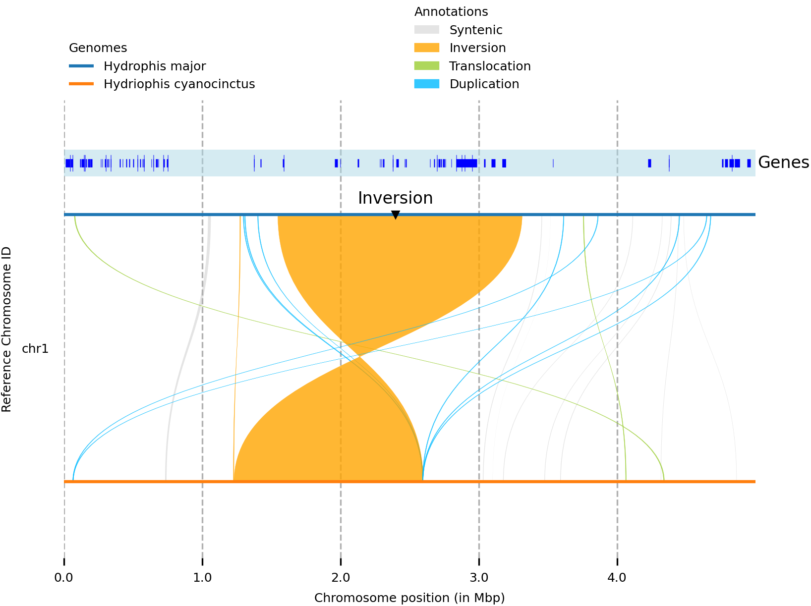

In part one I demonstrated how we can use gene annotations to quickly generate
synteny plots using MCscan. Here, we'll narrow in a bit and generate synteny plots
for fine-grain structural changes using Syri and genome alignments.
Thumbnail from: https://github.com/schneebergerlab/syri

---

# Introduction

In the [previous post][post1], I explored using `MCscan` to generate whole chromosome synteny plots, using gene annotations
as anchors to find syntenic regions between chromosomes. `MCscan` works great if you have an annotation file, or are able
to generate a rough annotation file if your organism doesn't have one. The reason we explored using it is for a couple of
reasons.

1. It's simple to use, providing wrapper functions for many of the tedious tasks that would normally be involved in such an analysis
2. Using gene sequences as anchors for alignments makes it fast. Especially compared to traditional sequence alignment tools
3. It has built in helper functions to generate publication ready figures

However, if you don't have gene annotaitons, or can't generate rough ones easily, `MCscan` is no longer an option. Further,
`MCscan` is great for macro-scale comparisons, but is not the best choice if you are interested in micro-synteny. Here, we'll
dive into using the tool [`Syri`][syri] to generate micro-synteny plots that rely only on sequence alignment.

# The software and data

For this analysis, we're going to need a few tools to get the job done. The first is a sequence aligner that can handle whole
genome alignments. There are many tools that are capable of this, however we're going to use [`Minimap2`][minimap2]. This is a
fast alignment tool that can many sequence types including, short-read DNA/RNA, third generation sequences (Nanopore/PacBio) and
whole genome alignments of varying divergence. We're going to use `Minimap2` as it is fast, simple to use and generates easy to use
alignment files (SAM). The next tool we'll need is `Syri`, which compares alignments bewteen two sequences, identifying synteny and
structural rearrangements. Lastly, we'll need the tool [`plotsr`][plotsr], which is used to generate the final figures. A summary
of what each tool is used for is below:

- **`Minimap2`**: Align chromosomal sequences
- **`Syri`**: Identify sytenic regions/rearrangements between the aligned chromosomes
- **`Plotsr`**: Generate publication ready plots from the `Syri` output

We're going to install this software using `conda`. I recommend installing `Minimap2` into an environment of its own, and `Syri`
and `plotsr` into a different environment together. This could be done as follows.

```bash
conda create -n minimap2 -c bioconda minimap2
conda create -n synteny -c bioconda syri plotsr
```

These two commands will create the environments `minimap2` which houses the `Minimap2` software and `synteny` which contains
the `Syri` and `plotsr` software. Once created, the environments can be activated using the following command.

```bash
conda activate <env name here>
```

The sequences we're going to align are provided in the Box directory [`Syri-resources/seqs`][box] directory. These sequences are the
first 5Mbp of chromosome 1 from *Hydrophis major* and *Hydrophis cyanocinctus*. In there, you'll also find some gene annotations for
*H. major* (`seqs/hydmaj.gff3`) which we'll use for plotting later on.

While I'll provide relevant code here in the tutorial, I have written a script that has all the steps that can be found in
`synteny-resources/script/syri-tutorial.sh`. **Please note that you'll need to change the paths to directories and files**
**to match your own system!**

# Step 1: Minimap2 alignment of chromosomal sequences

## Create chromosome sequence subsets

We first need to align the chromosomal sequences for *H. major* and *H. cyanocinctus*. Noramlly, we'd align all the chromosomes
from one species against all the chromosomes of the other. For the sake of time, we're going to use a smaller 5Mbp subset of the
start of chromosome 1. For interests sake, 5Mbp subset files were generated using the following code.

```bash
samtools faidx assembly.fa chr1 > assembly-subset.fa
```

## Align the sequences using Minimap2

To align the sequences we need to call `Minimap2`. The command recommended by the `Syri` developers is as follows.

```bash
conda activate minimap2
minimap2 \
    -ax asm5 \
    --eqx \
    -t threads \
    hydmaj-subset.fa \
    hydcya-subset.fa > hydmaj-hydcya.sam
conda deactivate
```

In the command above we provide the argument `-a` to specify we want `SAM` output rather than `PAF`. We also provide
the `-x asm5` argument to specify the assembly-to-assembly alignment preset with 0.1% sequence divergence. The argument
`--eqx` is to output =/X CIGAR operators in the SAM file (information about mismatches) while the `-t` argument specifies
how many threads we'll want to use. The output from this command is the alignment between the two 5Mbp sequences which
is stored in the file `hydmaj-hydcya.sam`.

Important to note is the activation and deactivation of the conda environment before running the program.

## Optional: Convert the alignment file to BAM format

I have not done it here, but you can also convert the `SAM` file to `BAM` format if you want to save some space. As we're
only aligning a few megabases of sequences, the `SAM` file doesn't get too large. However, if you're doing this on whole
genomes, it would be prudent to convert the output to `BAM` format before continuing. This could be managed as follows.

```bash
conda activate minimap2
minimap2 \
    -ax asm5 \
    --eqx \
    -t threads \
    hydmaj-subset.fa \
    hydcya-subset.fa |
samtools view -b -o hydmaj-hydcya.bam
conda deactivate
```

The example above pipes the output from `Minimap2` to `SAMtools` to conver the `SAM` output to `BAM` format, by
specifying the `-b` argument. This example assumes that `samtools` is installed in the `minimap2` conda environment.

# Step 2: Syri to find synteny/rearrangements

Now that we've got our alignment sorted, we can use `Syri` to find syntenic regions and structural rearrangements.
All we need to do is run the software like so.

```bash
conda activate syri
syri \
    -c hydmaj-hydcya.sam \
    -r hydmaj-subset.fa \
    -q hydcya-subset.fa \
    -F S \
    --cigar
conda deactivate
```

The command above takes as input the SAM alignment file we generated (`-c`) along with each of the sequences of interest,
with `-r` being the reference sequences and `q` being the query. What this means is that the query sequence will be compared
to the reference.

This is an important point about `Syri`: it is not reference free. This means that all comparisons will always
be 'in reference' to some particular sequence. This is good if we only want to compare between a few organisms, as we can simply
run a hierarchy of comparisons e.g. A - B and B - C. This would enable us to see how A compares to B, which is in turn compared
to organism C. As the number of species increases, it is perhaps better to use reference free tools like [Progressive Cactus][cactus]
or [Pan-Genome Graph Builder][pggb], which allows us to compare all sequences at once without requiring one organisms being
designated the anchor reference to which all other organisms are aligned.

Back to our `Syri` command. After providing the two sequences we aligned, we next provide the file format (`-F S` for `SAM`)a
along with the argument `--cigar`. This argument is required if we want to find SNP/INDELs using `SAM/BAM` alignment files.

This process will output the file `syri.out` in the directory where the command is run, so keep that in mind if you run
this yourself. For information about the output format, see the documentation [here][fileout].

# Step 3: Generate synteny plots

The final step is to plot the information in the `syri.out` file. The same group that wrote `Syri` wrote the plotting
tool `plotsr`. Below I'll walk through generating a simple synteny plot, the introduce a few steps we can take to zhoosh
it up a bit. Before we do anything though, we need to create a `genomes.txt` file.

## Genomes file

The [`genome.txt`][genomes] file provides a bit of -data about the genomes we've compared. It is a tab-separated, three-columned
file, with the three columns being 1) the path to the file, 2) the organisms name and 3) tags.. For our data, the file looks like so,
which can be found in the `syri` output directory on Box.

```text
/path/to/seqs/hydmaj-subset.fa	Hydrophis major	lw:1.5
/path/to/seqs/hydcya-subset.fa	Hydriophis cyanocinctus	lw:1.5
```

To create this file, copy the text above (ensureing the tab-spacing is maintained) into a file called `genomes.txt` in the
`syri` output directory (where the `SAM` alignment file is stored).

## Basic synteny plot

To generate a basic synteny plot using out output, we can simply run the following command.

```bash
plotsr \
     --sr syri.out \
     -o basic.png \
     --genomes genomes.txt \
     -W 6 \
     -H 4
```

This simply plots the information in `syri.out`, using the genome information from the `genomes.txt` file. The file
is then saved to `basic.png` in the current directory and look like the following image.


## Adding markers

The image above conveys a lot of information in the legend, but perhaps we'd like to annotate the features on the
tracks themselves. This can be done by creating and passing a [`markers.bed`][markers] file to `plotsr`. This is a
simple `BED` file with coordinate information about where to put markers. The developers have put together a list
of the types of markers you can use in your plot [here][markers2]. I've put together an example `markers.bed` file
in the `syri` output directory.

```text
#chr	start	end genome_id	tags
chr1	2400000	2400001	Hydrophis major	mt:v;mc:black;ms:3;tt:Inversion;tp:0.02;ts:8;tf:DejaVu Sans;tc:black
```

To use the marker information in the plot, we simply need to add the `--markers` argument to our call.

```bash
plotsr \
     --sr syri.out \
     -o markers.png \
     --genomes genomes.txt \
     --markers markers.bed \
     -W 6 \
     -H 4
```

In the plot below, you can see we now have 'inversion' marked on the track itself. This example is pretty basic, but could
be used to highlight key features in the figure.


## Adding tracks

The final thing we might like to do is overlay a track of some kind. The [`tracks.txt`][tracks] file houses information
about genetic feature files that we want to overlay on the figure. Genetic features are usually stored in `BED` or `GFF`
files, which represent the coordinates of genetic features we want to present/overlay. The `tracks.txt` file has three
columns: 1) the path to the feature file 2) the name of the track and 3) tags associated with that feature track.

I've provided an example `tracks.txt` in the `syri` directory which points to the gene annotaitons for chromosome 1 of
*H. major*. Importantly, the tracks that we want to overlay **must** correspond to the first genome (i.e. the reference
sequence) in the alignment. In our case this is *H. major*. The example looks like the following.

```text
# File	Name	Tags
/path/to/seqs/hydmaj.gff3	Genes	ft:gff;nc:black;ns:8;nf:DejaVu Sans;lc:blue;lw:4;bc:lightblue;ba:0.5
```

Again, to include the track information, we simply add the `--tracks` argument to our `plotsr` call (I also changed the
minimum size for structural rearrangements to 5000bp in this example too: `-s 5000`).

```bash
plotsr \
     --sr syri.out \
     -o tracks.png \
     --genomes genomes.txt \
     --markers markers.bed \
     -s 5000 \
     -W 6 \
     -H 4
```

The output of which looks like this




# What next?

This document provides an introduction to the tools needed to generate micro-synteny plots. There are many other
parameters that can be tweaked to get the sequences and plots just how you want them, so I encourage you to
mess around with the commands until you get what you're after.

A lot of the material I've put in here has come from the github repositories/documentation written by the devs.
I highly recommend you go and check these out, as they go into much more detail than I do in this document.

- `Minimap2` - [Documentation][minimap2]
- `Syri` - [Documentation][syridoc]
- `Plotsr` - [Documentation][plotsr]

As I mentioned above, all the resources for this tutorial are in the Box directory [`syri-resources`][box],
which has an example script, along with all the input, output and intermetiate files.

[post1]: https://a-lud.github.io/blog/Comparing-chromosomal-sequences-part-1
[syri]: https://github.com/schneebergerlab/syri
[syridoc]: https://schneebergerlab.github.io/syri/
[minimap2]: https://github.com/lh3/minimap2
[plotsr]: https://github.com/schneebergerlab/plotsr
[box]: https://universityofadelaide.app.box.com/folder/164542997470
[cactus]: https://github.com/ComparativeGenomicsToolkit/cactus
[pggb]: https://github.com/pangenome/pggb
[fileout]: https://schneebergerlab.github.io/syri/fileformat.html
[genomes]: https://github.com/schneebergerlab/plotsr#step-3-running-plotsr
[markers]: https://github.com/schneebergerlab/plotsr#visualising-markers
[markers2]: https://github.com/schneebergerlab/plotsr/blob/master/config/marker_point_type.txt
[tracks]: https://github.com/schneebergerlab/plotsr#visualising-tracks